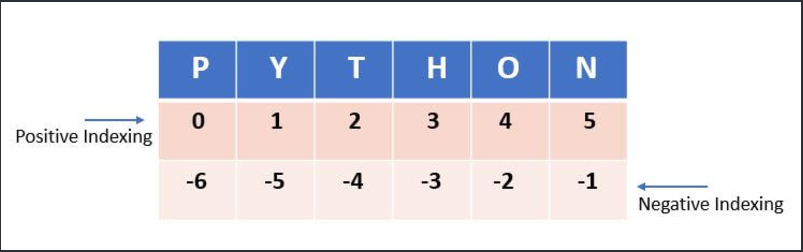

# 📚 Aula 8: Gerando SubStrings a partir de uma String

### Objetivos de Aprendizagem:

- Compreender o conceito de slicing (fatiamento) em Python
- Entender índices positivos e negativos em strings
- Aprender a extrair partes específicas de strings
- Dominar técnicas avançadas de manipulação de strings



### Código da Aula:

```python
# Definindo as strings de exemplo
gameName = 'Fifa23'
gameDescription = '''
Fifa 23 é um jogo de futebol
desenvolvido pela EA Sports
e que possibilita jogar
localmente ou online.
                '''

# Exemplo 1: Buscando toda string a partir da primeira posição
print(gameName[0:])  # Imprime: Fifa23

# Exemplo 2: Buscando toda string até a última posição
print(gameName[:6])  # Imprime: Fifa23

# Exemplo 3: Buscando toda string da primeira até a última posição
print(gameName[0:6])  # Imprime: Fifa23

# Exemplos avançados com step (passo)
# string[início:fim:passo]

# Exemplo 4: Buscando caracteres de 2 em 2
print(gameName[::2])  # Imprime: Ff2

# Exemplo 5: Invertendo a string
print(gameName[::-1])  # Imprime: 32afiF

# Exemplo 6: Imprimindo caracteres em índices ímpares
print(gameName[1::2])  # Imprime: ia3
```

### Exemplo de Saída:

```
Fifa23
Fifa23
Fifa23
Ff2
32afiF
ia3
```

### Explicação Detalhada do Slicing:

1. **Sintaxe Básica**: `string[início:fim:passo]`

   - `início`: Índice onde começa o slice (inclusivo)
   - `fim`: Índice onde termina o slice (exclusivo)
   - `passo`: Determina o intervalo entre caracteres selecionados

2. **Índices em Python**:

   - Positivos: começam do 0 (esquerda para direita)
   - Negativos: começam do -1 (direita para esquerda)
   - Para "Fifa23": F(0), i(1), f(2), a(3), 2(4), 3(5)

3. **Atalhos Comuns**:
   - `string[:]` - Copia toda a string
   - `string[::-1]` - Inverte a string
   - `string[::2]` - Pega caracteres alternados

### Exemplos Práticos Detalhados:

```python
palavra = "Python"
print(palavra[0:2])   # "Py" - Primeiros dois caracteres
print(palavra[-2:])   # "on" - Últimos dois caracteres
print(palavra[::-1])  # "nohtyP" - String invertida
print(palavra[::2])   # "Pto" - Caracteres em índices pares
```

### Dicas Importantes:

1. **Índices Omitidos**:

   - `string[:]` é igual a `string[0:len(string)]`
   - `string[:n]` é igual a `string[0:n]`
   - `string[n:]` vai de n até o final

2. **Passos Negativos**:

   - Úteis para inverter strings
   - Leem a string da direita para a esquerda
   - Exemplo: `string[::-1]`

3. **Boas Práticas**:
   - Use índices positivos quando possível
   - Prefira slices claros e explícitos
   - Documente slices complexos
