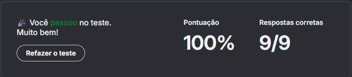

# 📌 Questionário

> Módulo: Quiz 2 - Collections

 

### Pergunta 1

#### Qual é a sintaxe correta para imprimir "Olá, mundo" em Python?

- [ ] print("Olá, mundo")

- [ ] echo "Olá, mundo"

- [ ] console.log("Olá, mundo")

- [ ] printf("Olá, mundo")

    
Resposta
 

    A sintaxe correta para imprimir "Olá, mundo" em Python é `print("Olá, mundo")`. As demais alternativas estão erradas: `echo` é um comando do terminal, `console.log` é um comando do JavaScript, e `printf` é um comando do C.

### Pergunta 2

#### Como você cria uma variável chamada 'a' que guarda o valor 10 em Python?

- [ ] a = 10

- [ ] var a = 10

- [ ] int a = 10

- [ ] a:10

    
Resposta

    Para criar uma variável chamada 'a' que guarda o valor 10 em Python, utilizamos a sintaxe `a = 10`. As demais alternativas estão erradas: `var` é uma palavra reservada do JavaScript, `int` é uma palavra reservada do Python, e `a:10` é uma sintaxe inválida.

### Pergunta 3

#### O que 'def' faz em Python?

- [ ] Define uma constante

- [ ] Define uma variável

- [ ] Define uma classe

- [ ] Define uma função

    
Resposta

    A palavra reservada `def` é utilizada para definir uma função em Python. As demais alternativas estão erradas: `Define uma constante` não é uma funcionalidade do Python, `Define uma variável` é feito com o operador de atribuição `=`, e `Define uma classe` é feito com a palavra reservada `class`.

### Pergunta 4

#### Como você cria uma lista em Python?

- [ ] lista = (1, 2, 3)

- [ ] lista = [1, 2, 3]

- [ ] lista = {1, 2, 3}

- [ ] lista = 

    
Resposta

    Para criar uma lista em Python, utilizamos a sintaxe `lista = [1, 2, 3]`. As demais alternativas estão erradas: `lista = (1, 2, 3)` cria uma tupla, `lista = {1, 2, 3}` cria um set, e `lista =` é uma sintaxe inválida.

### Pergunta 5

#### O que o seguinte código Python imprimirá? print(type(5))

- [ ] class 'int'

- [ ] class 'str'

- [ ] class 'float'

- [ ] class 'list'

    
Resposta

    O código `print(type(5))` imprimirá `<class 'int'>`. A função `type()` retorna o tipo de um objeto, e o número 5 é um inteiro, portanto o tipo retornado será `int`.

### Pergunta 6

#### Em Python, o que significa a palavra-chave 'None'?

- [ ] Indica que um método não retorna nada.

- [ ] É um valor numérico que representa zero.

- [ ] É um valor que representa a ausência de valor.

- [ ] É a forma Python de representar um erro.

    
Resposta

    Em Python, a palavra-chave `None` é um valor que representa a ausência de valor. Ela é utilizada para indicar que uma variável não possui um valor atribuído.

### Pergunta 7

#### Qual é a palavra-chave usada para iniciar um bloco condicional em Python?

- [ ] switch

- [ ] if

- [ ] begin

- [ ] let

    
Resposta

    A palavra-chave usada para iniciar um bloco condicional em Python é `if`. As demais alternativas estão erradas: `switch` é uma palavra reservada do JavaScript, `begin` não é uma palavra reservada do Python, e `let` é uma palavra reservada do JavaScript.

### Pergunta 8

#### Como é chamada a estrutura de repetição em Python que se baseia em uma condição para parar?

- [ ] for

- [ ] repeat

- [ ] while

- [ ] loop

    
Resposta

    A estrutura de repetição em Python que se baseia em uma condição para parar é o `while`. O `while` executa um bloco de código enquanto a condição for verdadeira.

### Pergunta 9

#### Qual método é usado para adicionar um item ao final de uma lista em Python?

- [ ] add()

- [ ] append()

- [ ] push()

- [ ] insert()

    
Resposta

    O método usado para adicionar um item ao final de uma lista em Python é o `append()`. O método `append()` adiciona um item ao final da lista.

