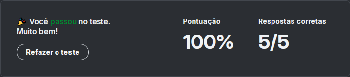

# 📌 Questionário

> Módulo: Quiz 1 - Fundamentos Python

 

### Pergunta 1

#### Qual é o nome da função em Python que é utilizada para imprimir mensagens dentro de um programa?

- [ ] `input()`

- [ ] `import()`

- [ ] `print()`

    
Resposta

    `print()` é a função em Python que é utilizada para imprimir mensagens dentro de um programa. As demais alternativas estão erradas: `input()` é utilizada para receber entradas do usuário, e `import()` é utilizada para importar módulos em Python.

### Pergunta 2

#### Qual é o tipo de dado que aceita apenas valores lógicos?

- [ ] `boolean`

- [ ] `float`

- [ ] `int`

    
Resposta

    O tipo de dado que aceita apenas valores lógicos é o `boolean`. As demais alternativas estão erradas: `float` é utilizado para representar números decimais, e `int` é utilizado para representar números inteiros.

### Pergunta 3

#### Assinale qual das alternativas a seguir representa uma característica da linguagem Python:

- [ ] É uma linguagem compilada.

- [ ] Linguagem de baixo nível.

- [ ] É uma linguagem de tipagem forte.

    
Resposta

    Uma característica da linguagem Python é que ela é uma linguagem de tipagem forte. As demais alternativas estão erradas: Python é uma linguagem interpretada, e é uma linguagem de alto nível.

### Pergunta 4

#### Qual é o tipo de dado recomendado para valores numéricos com ponto flutuante?

- [ ] `int`

- [ ] `float`

- [ ] `string`

    
Resposta

    O tipo de dado recomendado para valores numéricos com ponto flutuante é o `float`. As demais alternativas estão erradas: `int` é utilizado para representar números inteiros, e `string` é utilizado para representar texto.

### Pergunta 5

#### Qual elemento é utilizado para delimitar blocos de códigos em Python

- [ ] `Utiliza-se colchetes`

- [ ] `Utiliza-se chaves`

- [ ] `Utiliza-se a indentação do código`

    
Resposta

    Em Python, os blocos de códigos são delimitados pela indentação do código. As demais alternativas estão erradas: colchetes e chaves são utilizados em outras linguagens de programação como por exemplo Java, JavaScript etc...

